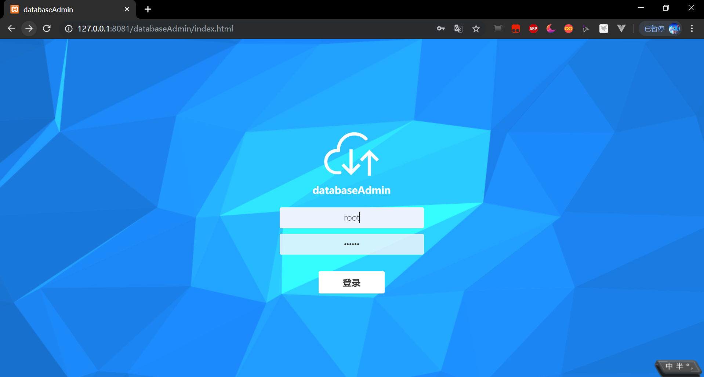
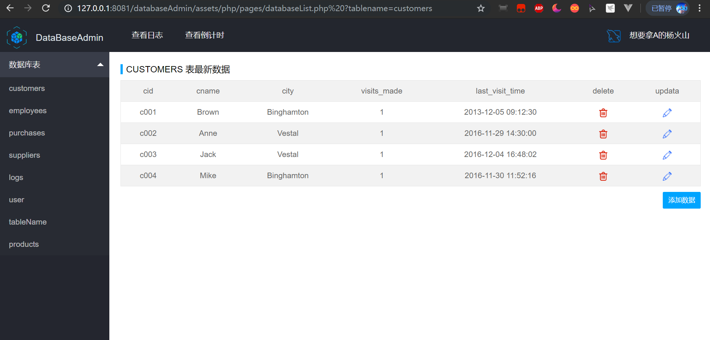
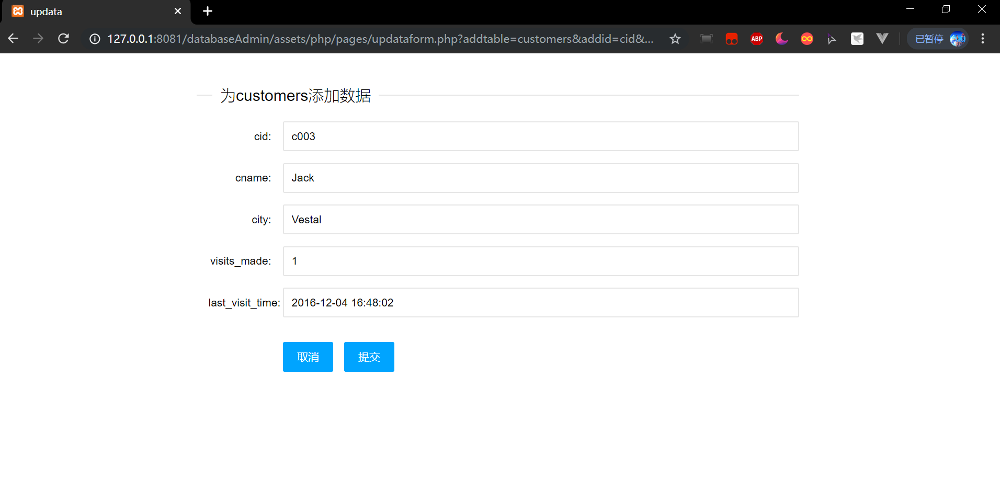
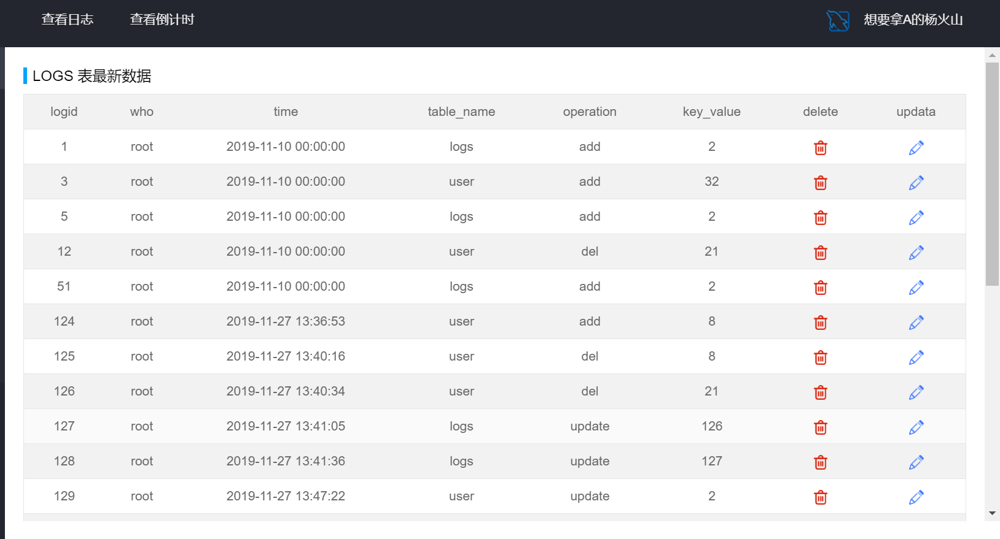
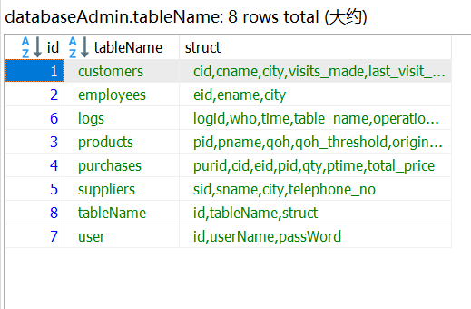
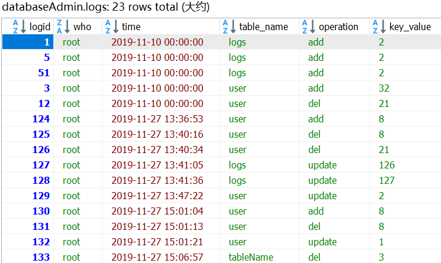
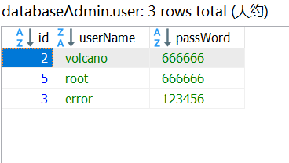

# databaseAdmin

## 功能描述
利用layui和php编写的数据库管理后台，可以动态渲染出后端数据库的所有表格数据，并能够在系统中直接增删改查数据，并且会记录日志，简单配置即可使用。

## 使用技术栈 

> layui+php+mysql


## 效果预览

* 登录页


* 数据表页


* 新增数据表单页


* 日志页



## 配置使用

### 1. 需要安装依赖

> npm install

### 2. 修改connet.php

``` php
    $servername = "数据库访问地址";
    $username = "数据库用户名";
    $password = "数据库用户密码";
    $dbname = "使用数据库名";
    $port = 端口号;

    $conn = new mysqli($servername, $username, $password, $dbname, $port);

    mysqli_set_charset($conn, "utf8");

    if ($conn->connect_error) {
        die("连接失败: " . $conn->connect_error);
    }

```

### 3. 建立数据库表

必要的数据库表：user表、tableName表和logs表

####  tableName表 
我在这个表里，记录了管理的数据库中每一个表的名称，和每一个表的结构（用一个字符串储存，后期根据','分割成数组使用）


####  logs表
储存数据库操作日志，key_value是操作的该行数据的主键值




#### user表




### 最后希望我的代码能够对各位有用，工作顺利，学业进步，大吉大利。